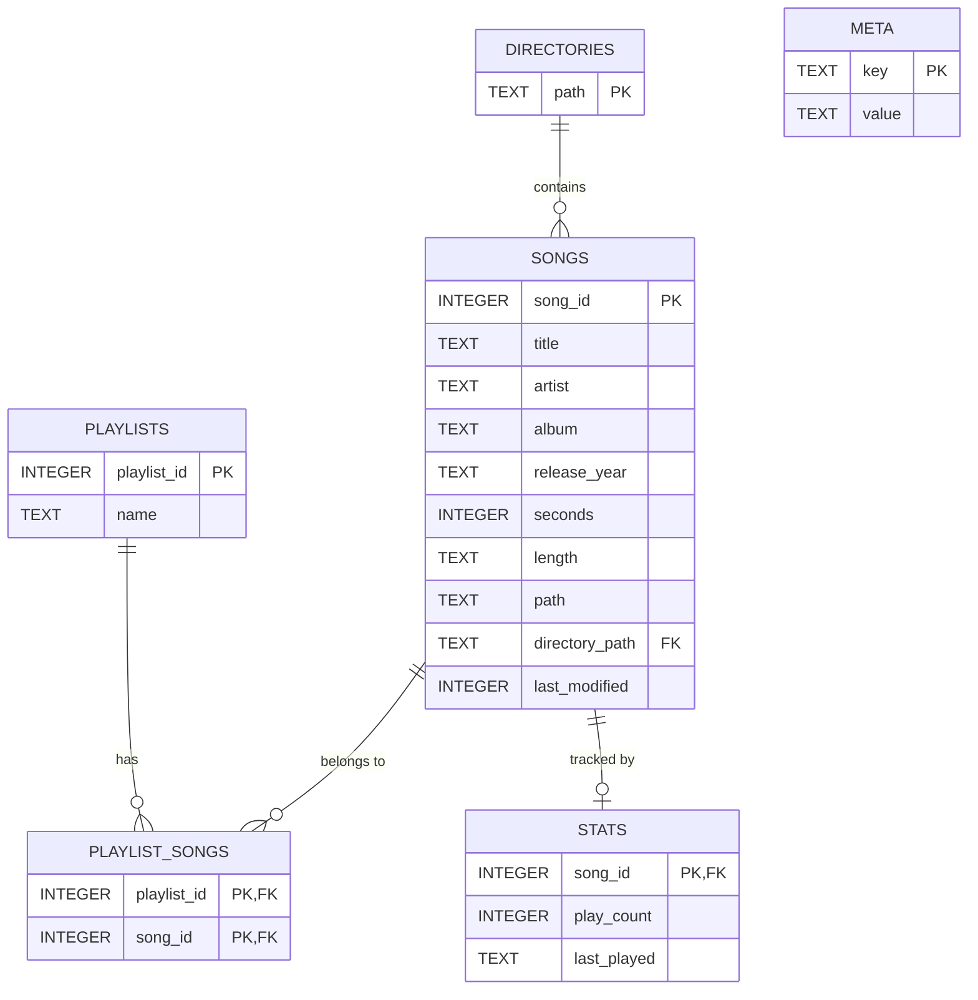

# MusicPlayer
A lightweight all-java local music player for FLAC, MP3, and WAV.

To access a demo of the application hosted in a virtual machine press [here](https://mayar.dev/)

> COMP-2800 - Software Development \
> University of Windsor, School of Computer Science \
> Professor: Dr. Andreas S. Maniatis \
> Term: 2026 Winter

## Table of Contents
1. [Features](#features)
2. [Architecture](#architecture)
3. [Installation](#installation)
4. [Database](#database)
5. [Usage](#usage)
7. [Screenshots](#screenshots)
8. [Documentation](#documentation)
9. [License](#license)

## Features
- FLAC, MP3, and WAV playback
- Playlists (create, delete, add/remove songs)
- Lyrics from LRC files (both synced and not synced)
- Multiple directory scanning
- All normal playback features (loop song, shuffle queue, forward, reverse, next track, previous track, volume controls)
- A Shareable weekly stats image
- library and playlist storage using SQLite

## Architecture

This project uses the **MVC (Model-View-Controller)** design pattern and is built entirely in Java using the Swing UI framework
```bash
.
├── build.sh
├── lib                                 # Bundled third part dependencies
│   ├── ...
│   └── tritonus-share-0.3.7-2.jar
├── LICENSE
├── README.md
├── res
│   └── icons/                          # icon assets
└── src
    ├── MusicPlayer.java                # Entry point
    ├── controller                      # Event handling
    │   ├── ...
    │   └── VolumeSliderListener.java
    ├── model                           # Data layer
    │   ├── ...
    │   └── Song.java
    └── view                            # UI layer
        ├── components
        │   ├── ...
        │   └── TopBarPanel.java
        ├── ...
        └── View.java
```

### Key technologies
- **Java Swing** - UI framework
- **SQLite** - persistent local database
- **Beads and JFlac** - audio decoding and playback
- **Java 17** - minimum required version

## Installation

### Prerequisites
- [OpenJDK 25](https://jdk.java.net/25/) <br> (recommended, will work for Java 17 and up)

### Option 1: Precompiled Jar (Recommended)
1. Download the latest release [here](https://github.com/Mai-19/comp-2800-project/releases/latest)
2. Run with `java -jar MusicPlayer.jar`

### Option 2: Build from source
1. **Clone the repository**
```bash
git clone https://github.com/Mai-19/java-music-player.git
cd java-music-player
```
2. **Run the build script**

On Linux/MacOS:
```bash
chmod +x build.sh
/build.sh
```
On Windows:
```bash
build.bat
```
3. **Run**
```bash
java -jar MusicPlayer.jar
```
## Database

The app uses an SQLite database for persistent storage of your music library, playlists, and play history

### Location
The database is created automatically on first launch at `$HOME/JavaMusicPlayer-Data/MusicPlayerDB.sqlite`, no manual setup is required

### Schema



| Table | Description |
|---|---|
| `DIRECTORIES` | Music folders registered by the user. Cascades deletes to `SONGS`. |
| `SONGS` | All scanned songs with metadata (title, artist, album, year, duration, file path). |
| `PLAYLISTS` | User-created playlists (name must be unique). |
| `PLAYLIST_SONGS` | Junction table linking songs to playlists. Cascades deletes from both parent tables. |
| `STATS` | Per-song play count and last-played timestamp, used to generate the weekly stats image. |

The database connection is managed by [`DatabaseManager.java`](./src/model/DatabaseManager.java).

## Usage
### Adding a directory
1. Click the **Settings** icon (top right)
2. Click the **+** icon next to "Directories" and select your music folder
3. Click the **:arrow_left:** button and your songs will appear in the All Songs tab

### Playing Music
- Double-click any song to play it
- Use the bottom bar controls for shuffle, loop, skip, and volume
- Right click a song for additional options (add to playlist, remove, etc.)

### Playlists
- Navigate to the **Playlists** tab to view and manage playlists
- Click **+** to create a new playlist
- Right-click songs in any view to add them to a playlist

### Lyrics
Place a `.lrc` file in the same directory as your song file with the same base filename:
```
really-good-song.flac  ->  really-good-song.lrc
```
The lyrics tab will auto-detect and display (synced and non-synced) lyrics for the song.

For more info on [LRC](https://en.wikipedia.org/wiki/LRC_(file_format))

### Getting the weekly stats image
go to **Settings** and press the **Download Stats** button at the bottom of the page to save an image of your top 5 played songs of the week


## Screenshots
<p float="left">
  
  
  
  
  
</p>


## Documentation

- [Deployment](./docs/deployment.md)
- [Design](./docs/design.md)
- [Database Schema File](./docs/schema.sql)
- [User guide](./docs/user-guide.md)
- [User requirements document](./docs/user-requirements.md)
- [Report](./docs/final-report.md)
- [Presentation](./docs/presentation.pptx)

## License
[LGPL-3.0](./LICENSE)
